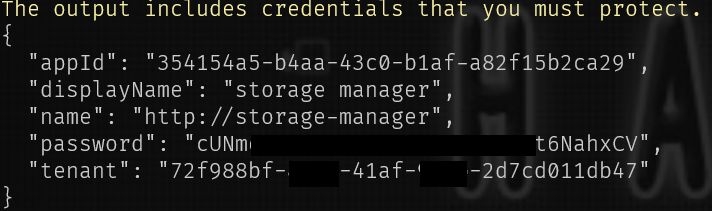
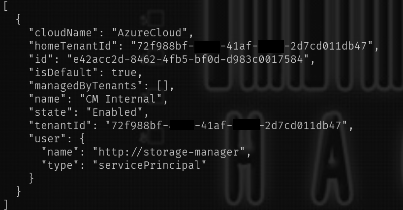
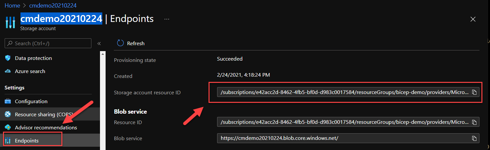

# Next.js + Azure Storage Upload

This is an example of a Next.js application allowing you to upload photos to an Azure Storage Account.

## Getting Started

**Option 1: Use an existing Azure Storage Account**

When running locally, the `Azure.Identity` library expects a user signed in to the Azure CLI. This user needs to have the following permission
in the associated Azure Storage account: `Storage Blob Data Contributor`

**Option 2: Create an Azure Storage Account**

1. Open the Azure CLI
1. Type `az login`
1. Create a resource group with `az group create --name <resource group name> --location westus`
1. Create a storage account `az storage account create --name <account-name> --resource-group storage-resource-group --location westus --sku Standard_RAGRS --kind StorageV2`

## Create a Service Principal for local testing (optional)
It's recommended practice to use a Service Principal account instead of your own when testing your applications against Azure.
To create a Service Principal account, you can use the following commands in the Azure CLI

1. `az login`
1. Create the SP with the following command: `az ad sp create-for-rbac --name "<your SP name>" --role contributor --scopes "<your storage account resource id>"`

1. Now login to the Azure CLI with the new SP credentials: `az login --service-pricipal --username APP_ID --password PASSWORD --tenant TENANT_ID`
1. You can confirm that you're now signed in with the SP account by running this command: `az account show`

> You can find the Resource ID of your Storage Account in the **Azure Portal > Storage Account > Endpoints** or you can use the CLI
`az storage account show --name <your storage account name> --query 'id'`

## Commands
- `yarn dev` – Starts the Next.js app at `localhost:3000`.

## Deploy to Azure
For the infrastructure, you can use the `webapp.bicep` file in the **deployment** directory to deploy an Azure Web App to run this Next.js app

Steps to deploy:

1. In the Azure CLI, sign in with an account that has subscription `Contributor` role
1. Use the `webapp.bicep` file to deploy the Azure Infrastrucure
1. Then use the following command to deploy the bicep template: `az deployment group create --resource-group <your resource group name> --template-file webapp.bicep`

To deploy the code, you can use the committed GitHub action or use one of these [options](https://docs.microsoft.com/en-us/azure/developer/javascript/how-to/deploy-web-app#deploy-your-web-app-to-azure) in the official documentation
